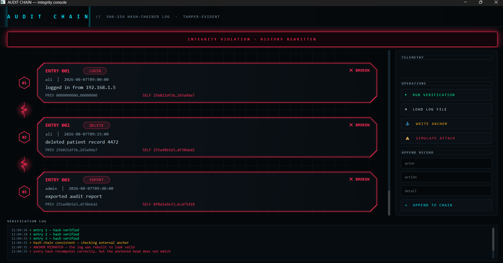
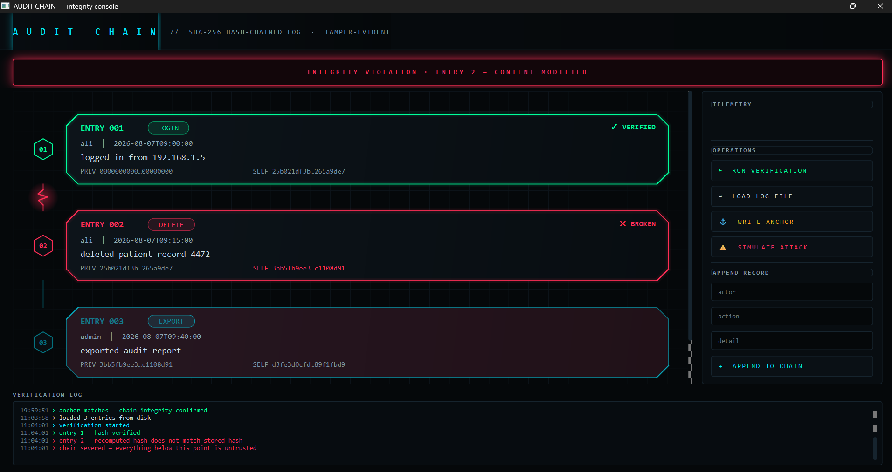
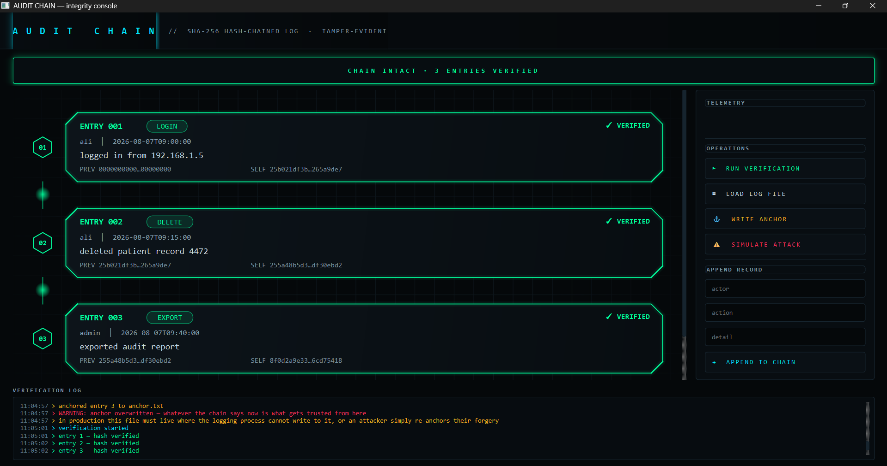

# Audit Chain

A tamper-evident audit log in C++. Every record is cryptographically linked to the
one before it, so any modification to history becomes provably detectable — and
external anchoring catches an attacker who rewrites the entire chain to cover it up.

Built with SHA-256 hash chaining, the same technique behind certificate transparency
logs, git commits, and blockchain ledgers.



## How it works

Each entry stores a hash computed from its own contents **plus the previous entry's
hash**. Change one character anywhere in the log and that entry's hash no longer
matches, which breaks every link after it.

```
Entry 1  prev=0000…      →  hash=25b021df…
Entry 2  prev=25b021df…  →  hash=3bb5fb9e…
Entry 3  prev=3bb5fb9e…  →  hash=d3fe3d0c…
```

Verification walks the chain and checks two things per entry:

1. Does the entry's content still produce its stored hash?
2. Does its `prevHash` still match the previous entry's hash?

**Canonical serialization.** Fields are length-prefixed (`3:ali|6:DELETE|…`) before
hashing, so two different sets of field values can never produce the same input
string. This is where most naive implementations break — concatenating fields
directly lets an attacker craft colliding records.

## Detecting a naive edit

Editing a record's text without recomputing its hash is caught immediately, and the
verifier reports exactly which entry failed.



## Detecting a full rewrite

A more capable attacker with access to the source can edit a record *and* recompute
every hash downstream, leaving a chain that is internally consistent and passes
verification.

This is the attack plain hash chaining cannot detect. It's caught by anchoring: a
checkpoint storing a past entry's sequence number and hash, held outside the log.
The chain is free to grow, but the anchored entry must never change — and since
every hash depends on all entries before it, an unchanged hash at entry N proves
nothing up to N was touched.


## Threat model — and its limits

This system makes tampering **detectable**, not impossible.

An attacker who can write to the log *and* to the anchor simply re-anchors their
forgery, and nothing catches it. The app demonstrates this deliberately:



The anchor is only meaningful if it lives somewhere the logging process cannot
reach — a separate host, read-only media, a printed copy, or a published value.
If roots are stored beside the raw log with the same write access, the integrity
model collapses.

**Detects:** content edits, deleted entries, inserted entries, reordering, and full
chain rewrites (with a protected anchor).

**Does not prevent:** an attacker with write access to both the log and the anchor.
Preventing that requires append-only storage, digital signatures, or a
third-party-published root.

## Building

Requires Qt 6 and a C++17 compiler.

```
git clone https://github.com/subtilizer-01/audit-chain.git
cd audit-chain
qmake AuditChainViewer.pro
make
```

Or open `AuditChainViewer.pro` in Qt Creator and build.

## Layout

| File | Purpose |
|---|---|
| `logchain.h` | `LogEntry` and `LogChain` — hashing, chaining, verification, persistence, anchoring |
| `mainwindow.cpp` | Qt interface, custom-painted chain visualisation, animated verification sweep |
| `SHA256.h` / `.cpp` | SHA-256 implementation |

## Notes

`simulateFullRewrite()` exists purely to demonstrate the rewrite attack. It is not
a feature of the logging system.
